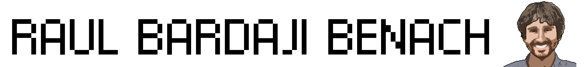

## Contact Information

- LinkedIn: <a href="https://www.linkedin.com/in/raul-bardaji-benach/" target="_blank">https://www.linkedin.com/in/raul-bardaji-benach</a>
- GitHub: <a href="https://github.com/rbardaji" target="_blank">https://github.com/rbardaji</a>

## Work Experience

### La Salle - Ramon LLull University, Telecomunications Engineer, December 2008 - December 2012

- Hardware developer
    - Notable Archivement: As a member of a development team, we created the first operational Ionospheric Data Transmitter that transmitted scientific data from the <a href="https://goo.gl/maps/YZjg64aatt1LY4Be7" target="_blank">Spanish Antarctic Base Juan Carlos I</a> and the <a href="https://goo.gl/maps/StAjEK6YRuqbgPTSA" target="_blank">Ebro Observatory (Spain)</a> over a distance of 13000 km.
    - Tools and software used for the developments:
        - <a href="https://www.altium.com/" target="_blank">Altium</a>
- Software developer
    - Notable Archivement: I developed the software to operate and manage the previously mentioned Ionospheric Data Transmitter.
    - Programming languages used for the developments:
        - C
        - C++
- Field engineer
    - Notable Archivement: Responsible for the installation, maintenance, and repair of the Ionospheric Transmitter and related equipment at the <a href="https://goo.gl/maps/YZjg64aatt1LY4Be7" target="_blank">Spanish Antarctic Base Juan Carlos I</a>.
- Matlab instructor
    - Notable Archivement: Successfully instructed an elective course in Matlab for second and third-year students in Electronic and Telecommunications Engineering at La Salle.
